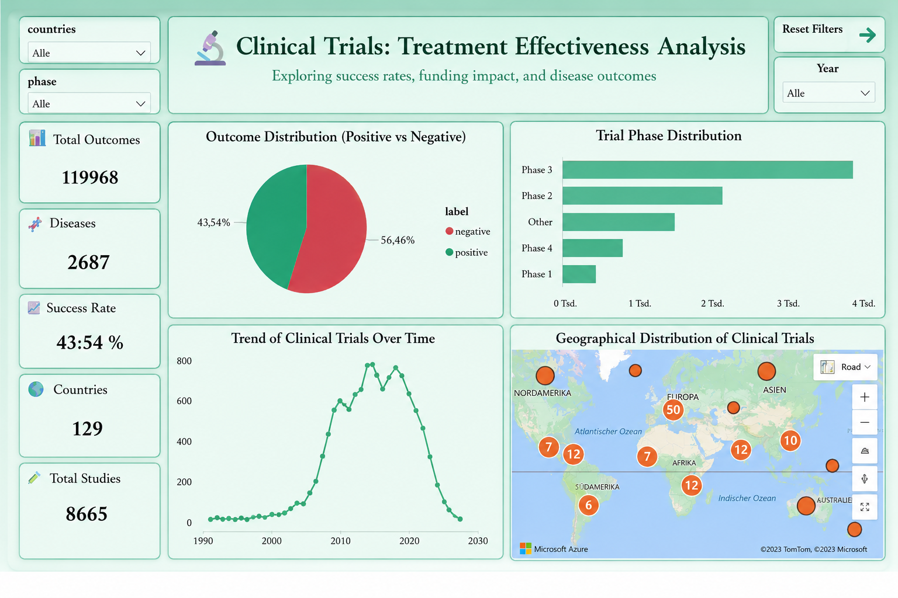

# 🔬 Clinical Trials Treatment Effectiveness Analysis



## 📋 Projektbeschreibung

Analyse von **119.968 klinischen Studiendaten** aus ClinicalTrials.gov 
zur Untersuchung von Behandlungseffektivität, Studienerfolg und 
systematischen Verzerrungen im globalen Forschungskontext.

**Zeitraum:** 1993 – 2026  
**Länder:** 129  
**Ausgangsspalten:** 49 → 18 neue Features engineered

---

## 🛠️ Tech Stack

| Tool | Verwendung |
|------|-----------|
| **Python** | Datenbereinigung, EDA, Feature Engineering |
| **Pandas** | Datenmanipulation & Transformation |
| **Matplotlib** | Explorative Visualisierungen |
| **Power BI** | Interaktives Dashboard (Star Schema, DAX) |

---

## 🔍 Zentrale Erkenntnisse

### 1️⃣ Valley of Death – Phase-2-Dropout
Phase 2 zeigt die höchste Abbruchrate im gesamten 
klinischen Entwicklungsprozess. Studien scheitern 
hier systematisch häufiger als in allen anderen Phasen.

### 2️⃣ Finanzierungsquelleneffekt
Industriefinanzierte Studien weisen systematisch 
höhere Erfolgsraten auf als öffentlich finanzierte – 
bedingt durch Selektionsverzerrung: Unternehmen 
starten Studien nur bei positiven Frühsignalen.

### 3️⃣ Publikationsbias
Negative Studienergebnisse werden signifikant 
seltener veröffentlicht, was das Gesamtbild 
der Forschungseffektivität verzerrt.

---

## 📊 Power BI Dashboard

**6 interaktive Seiten:**
- Globale Übersicht (129 Länder)
- Phasenanalyse & Dropout-Raten
- Finanzierungsquellenvergleich
- Krankheitsspezifische Outcomes
- Zeitliche Entwicklung (1993–2026)
- Limitationen & Handlungsempfehlungen

**Features:**
- Star Schema Datenmodell
- DAX Measures
- Filter nach Jahr, Phase, Finanzierung, Land
- Drill-Down Funktionen

---

## 🔧 Feature Engineering

Aus 49 Ausgangsspalten wurden **18 neue Features** entwickelt:

- Composite Success Indicator (3-Felder-Kombination)
- Phase-Klassifikation
- Finanzierungstyp-Kategorisierung
- Zeitliche Verlaufsvariablen
- Geografische Aggregationen

---

## 📁 Projektstruktur

Clinical-Trials-Analysis/
│
├── 📁 scripts/
│   └── clinical_trials_analysis.py
│
├── 📁 screenshots/
│   └── dashboard_preview.png
│
├── 📁 presentation/
│   └── Clinical-Trials-Treatment-Effectiveness.pptx
│
└── README.md


---

## 🚀 Reproduktion

```bash
# Repository klonen
git clone https://github.com/Borisy-94/Clinical-Trials-Analysis

# Libraries installieren
pip install pandas matplotlib seaborn

# Analyse starten
python scripts/clinical_trials_analysis.py
```

---

## 💡 Limitationen

- Composite Success Indicator selbst definiert → 
  Transparente Dokumentation der Definition
- Publikationsbias nicht vollständig quantifizierbar
- Industriefinanzierungseffekt: Korrelation ≠ Kausalität

---

## 👨‍💻 Autor

**Boris Petamba** – Junior Data Analyst  
📧 borispetamba@gmail.com  
🔗 [LinkedIn](https://linkedin.com/in/borispetamba)  
💻 [GitHub](https://github.com/Borisy-94)
